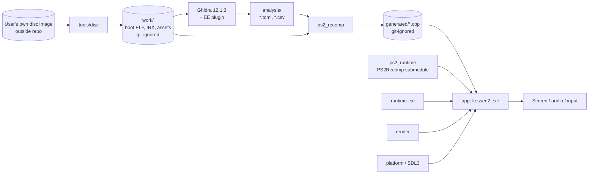

# Architecture

Kessen II (PS2) is ported by **static recompilation**: the game's own MIPS R5900 code is translated to C++ by PS2Recomp's `ps2_recomp` and linked against a host runtime. No game code, data or recompiler output is ever stored in this repository (see [LEGAL.md](LEGAL.md)).

## Data flow



```
 disc image ──► tools/disc ──► work/ (boot ELF) ──► Ghidra+EE ──► analysis/*.toml,csv
                                     │                                   │
                                     └──────────────► ps2_recomp ◄───────┘
                                                          │
                                                   generated/*.cpp
                                                          │
  ps2_runtime ◄── runtime-ext        render ──► platform (SDL3)
        ▲               ▲               ▲            ▲
        └───────────────┴───── app (kessen2) ────────┘   ◄── generated
```

## Modules

| Directory | Target | Role |
|---|---|---|
| `tools/disc/` | `k2_disc_core`, `k2disc` | Extract the ISO, identify boot ELF/IRX, catalogue formats, unpack `LINKDATA.BNS` into `work/` ([disc.md](modules/disc.md)) |
| `analysis/` | _(data)_ | Human-authored recompiler config / function tables |
| `generated/` | `k2_generated` (only when sources exist) | `ps2_recomp` output |
| `external/PS2Recomp/` | `ps2_runtime` | Upstream runtime (git submodule, never edited) |
| `runtime-ext/` | `k2_runtime_ext` | **All Kessen II–specific runtime logic** (game overrides, syscall/stub bindings, patches) |
| `render/` | `k2_render` | Host renderer for GS/VU output |
| `platform/` | `k2_platform` | Window, input, audio device, timing (SDL3) |
| `app/` | `kessen2` | Composition root |

Each module README states Purpose / Inputs / Outputs / Allowed dependencies / Forbidden — index in [modules/](modules/README.md).

## Dependency rule

| Module target | May link |
|---|---|
| `k2_platform` | SDL3 only |
| `k2_render` | `ps2_runtime`, `k2_platform` |
| `k2_runtime_ext` | `ps2_runtime` |
| `k2_generated` | `ps2_runtime` |
| `kessen2` (app) | everything above |

Why: the platform and renderer must stay game-agnostic and reusable; generated code is huge, volatile and local-only, so only the composition root may see it. Game-specific behaviour goes in `runtime-ext/` and binds to guest code **by address** through the runtime, not by including generated headers.

### Enforcement

1. **CMake** — [`cmake/K2Modules.cmake`](../cmake/K2Modules.cmake). Each module is registered with `k2_add_module(<target> ALLOWS …)`; externals `ps2_runtime` and `SDL3::SDL3` are guarded with `k2_register_guarded()`. `k2_verify_module_graph()` (last call in the root `CMakeLists.txt`) treats direct edges as deny-by-default: every target in a module's `LINK_LIBRARIES` / `INTERFACE_LINK_LIBRARIES` must be in its `ALLOWS` list, whether guarded or not (so third-party targets such as `raylib`, `imgui` or `ps2_iop` are rejected unless allowlisted; plain non-target link items are ignored). Allowlisted unguarded helpers are then walked transitively, so a guarded edge smuggled through one is caught too. Configuration fails on any such violation, or if the generated directory appears in a non-app module's include directories.
2. **Source scan** — [`tools/guard/check-forbidden.sh`](../tools/guard/check-forbidden.sh) rejects `#include`s of `ps2_recompiled_*` or `generated/` headers in `platform/`, `render/` and `runtime-ext/` (catches relative-path includes CMake cannot see).
3. **Tests** — `ctest` runs `k2_dep_rule_negative` (a compiler-free fixture that must accept the valid graph and reject a direct forbidden link, an indirect one through a helper target, and a generated include dir) and `k2_guard`.

## Build composition

The root `CMakeLists.txt` is a superbuild: SDL3 via `FetchContent` (pinned SHA), PS2Recomp via `add_subdirectory(external/PS2Recomp EXCLUDE_FROM_ALL)` with only its runtime enabled, then the modules. Upstream's `ps2EntryRunner` is **not** used: it globs generated code from inside the submodule. Our `app/` links `ps2_runtime` + `generated/` + `runtime-ext` instead ([ADR-0004](adr/0004-module-boundaries-and-composition-root.md)).

Options: `KESSEN2_WITH_PS2RECOMP` (default ON; OFF builds the stubs without the runtime), `KESSEN2_GENERATED_DIR` (default `generated/`).
